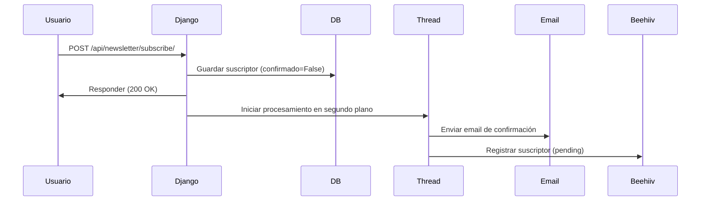
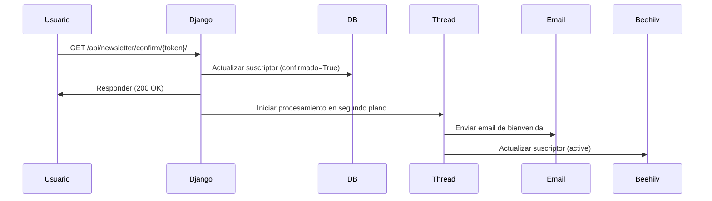

# Guía de Integración con Beehiiv

Este documento explica cómo funciona la integración con Beehiiv en nuestra aplicación FuturPrive para la gestión de newsletters.

## Índice

1. [Visión General](#visión-general)
2. [Estructura de Archivos](#estructura-de-archivos)
3. [Flujo de Suscripción](#flujo-de-suscripción)
4. [Configuración](#configuración)
5. [Endpoints de la API](#endpoints-de-la-api)
6. [Seguridad y CORS](#seguridad-y-cors)
7. [Manejo de Errores](#manejo-de-errores)
8. [Depuración y Solución de Problemas](#depuración-y-solución-de-problemas)

## Visión General

Nuestra plataforma utiliza Beehiiv como sistema de gestión de newsletters. Cuando un usuario se suscribe, se sigue un proceso de doble opt-in:

1. El usuario se registra a través de nuestro formulario web
2. Guardamos su información en nuestra base de datos local
3. Enviamos un email de confirmación
4. Registramos al usuario en Beehiiv (en segundo plano)
5. Cuando el usuario confirma, actualizamos su estado y lo marcamos como confirmado en Beehiiv

La integración está diseñada para ser robusta frente a:

- Problemas de conexión con Beehiiv
- Timeouts de API
- Fallos de email

## Estructura de Archivos

Los archivos clave para la integración son:

- **`backend/api/beehiiv.py`**: Contiene las funciones para comunicarse con la API de Beehiiv
- **`backend/api/views_newsletter.py`**: Contiene los endpoints para gestión de suscriptores
- **`backend/api/models.py`**: Define el modelo `Subscriber` que almacena suscriptores
- **`backend/api/welcome_email.py`**: Gestiona el envío de emails de bienvenida
- **`backend/config/settings.py`**: Contiene la configuración de Beehiiv (API keys, IDs, etc.)

## Flujo de Suscripción

### 1. Suscripción Inicial



### 2. Confirmación de Suscripción



## Configuración

### Variables de Entorno

Estas variables deben estar configuradas en el archivo `.env` del backend:

```
# Beehiiv API
BEEHIIV_API_KEY=your_api_key_here
BEEHIIV_PUBLICATION_ID=pub_your_publication_id_here

# Email (para envío de confirmaciones)
EMAIL_HOST=your_smtp_host
EMAIL_PORT=587
EMAIL_USE_TLS=True
EMAIL_HOST_USER=your_email@example.com
EMAIL_HOST_PASSWORD=your_email_password

# URL del sitio (para enlaces de confirmación)
SITE_URL=https://futurprive.com
```

### Configuración de Beehiiv

En el panel de administración de Beehiiv debes:

1. Generar una API key con permisos de escritura
2. Obtener tu Publication ID
3. Configurar las plantillas de email (opcional, ya que usamos nuestros propios emails)

## Endpoints de la API

### 1. Suscripción

**URL**: `/api/newsletter/subscribe/`  
**Método**: POST  
**Permisos**: Público  
**Cuerpo**:

```json
{
  "email": "usuario@example.com",
  "name": "Nombre Usuario" // Opcional
}
```

**Respuesta exitosa**:

```json
{
  "success": true,
  "message": "Te hemos enviado un correo para confirmar tu suscripción."
}
```

### 2. Confirmación

**URL**: `/api/newsletter/confirm/{token}/`  
**Método**: GET  
**Permisos**: Público  
**Parámetros**: `token` - Token UUID de confirmación  
**Respuesta exitosa**:

```json
{
  "success": true,
  "message": "¡Gracias! Tu suscripción ha sido confirmada con éxito."
}
```

### 3. Cancelación de Suscripción

**URL**: `/api/newsletter/unsubscribe/{token}/`  
**Método**: GET/POST  
**Permisos**: Público  
**Parámetros**: `token` - Token UUID del suscriptor  
**Respuesta exitosa**:

```json
{
  "success": true,
  "message": "El correo example@email.com ha sido eliminado de nuestra lista."
}
```

## Seguridad y CORS

### Configuración CORS

Utilizamos `django-cors-headers` con la siguiente configuración:

- En producción: Solo se permiten peticiones desde `futurprive.com` y sus subdominios
- En desarrollo: Se permite también `localhost:3000`

Los endpoints de newsletter tienen un manejo especial de CORS para garantizar que las peticiones desde el frontend sean aceptadas incluso si hay errores.

### Seguridad

- Todos los tokens son UUIDs aleatorios
- Las confirmaciones requieren un token válido
- Las API keys se almacenan solo en variables de entorno

## Manejo de Errores

La integración está diseñada para ser tolerante a fallos:

1. **Procesamiento Asíncrono**:

   - Todo el procesamiento pesado ocurre en segundo plano
   - La experiencia del usuario no se ve afectada por problemas con Beehiiv

2. **Sistema de Reintentos**:

   - Reintentos automáticos con backoff exponencial para llamadas a Beehiiv
   - Manejo de rate-limiting (respuestas 429)

3. **Fallbacks**:
   - Si falla el envío de email, se intenta registrar directamente en Beehiiv
   - Los datos siempre se guardan en nuestra base de datos local

## Depuración y Solución de Problemas

### Logs

Los logs tienen prefijos específicos para facilitar la depuración:

- `[BEEHIIV]` - Operaciones normales con Beehiiv
- `[BEEHIIV-FALLBACK]` - Operaciones de contingencia
- `[CONFIRMACIÓN]` - Procesos de confirmación de suscripción

### Problemas Comunes

1. **Timeout en Gunicorn**

   - Síntoma: Error 502 en la API
   - Solución: Verificar que el timeout de Gunicorn esté configurado a 120 segundos

2. **Errores de CORS**

   - Síntoma: Error en la consola del navegador sobre CORS
   - Solución: Verificar que el origen correcto esté en `CORS_ALLOWED_ORIGINS`

3. **Fallos de comunicación con Beehiiv**
   - Síntoma: Logs con `[BEEHIIV] ERROR`
   - Solución: Verificar credenciales y conectividad a `api.beehiiv.com`

### Herramientas de Diagnóstico

1. **Verificar el estado de un suscriptor en la base de datos**:

```python
from api.models import Subscriber
subscriber = Subscriber.objects.get(email="example@email.com")
print(f"Confirmado: {subscriber.confirmed}")
```

2. **Probar conexión con Beehiiv manualmente**:

```python
from api.beehiiv import add_subscriber_to_beehiiv
success, message = add_subscriber_to_beehiiv(email="test@example.com")
print(f"Resultado: {success}, Mensaje: {message}")
```

## API de Beehiiv

### Documentación Oficial

- [Documentación General](https://developers.beehiiv.com/welcome/getting-started)
- [API Reference](https://developers.beehiiv.com/api-reference/subscriptions/create)
- [Webhooks](https://developers.beehiiv.com/webhooks/subscription/created)

### Endpoints Principales

1. **Crear/Actualizar Suscripción**

   ```
   POST https://api.beehiiv.com/v2/publications/{publication_id}/subscriptions
   ```

2. **Obtener Suscriptor**
   ```
   GET https://api.beehiiv.com/v2/publications/{publication_id}/subscriptions?email={email}
   ```

### Consejos para Desarrollo

1. **No hagas llamadas directas a Beehiiv desde el frontend**

   - Siempre usa nuestro backend como intermediario

2. **Usa la versión de API v2 de Beehiiv**

   - La v1 está deprecada

3. **Monitorea los tiempos de respuesta**
   - Si Beehiiv está lento, usa más procesamiento asíncrono

---

## Comandos Útiles

### Sincronizar Suscriptores con Beehiiv

Para sincronizar manualmente todos los suscriptores con Beehiiv:

```bash
python manage.py shell
```

```python
from api.models import Subscriber
from api.beehiiv import add_subscriber_to_beehiiv

subscribers = Subscriber.objects.filter(confirmed=True)
for sub in subscribers:
    print(f"Sincronizando {sub.email}...")
    success, msg = add_subscriber_to_beehiiv(sub.email, sub.name, is_confirmed=True)
    print(f"Resultado: {success}, {msg}")
```

### Verificar Configuración

Para verificar que la configuración esté correcta:

```python
from django.conf import settings

print(f"API Key configurada: {'Sí' if settings.BEEHIIV_API_KEY else 'No'}")
print(f"Publication ID: {settings.BEEHIIV_PUBLICATION_ID}")
print(f"Site URL: {settings.SITE_URL}")
```

## Actualizaciones Futuras

Funcionalidades planeadas:

1. Implementación de webhooks para sincronización bidireccional
2. Sistema de colas (Celery) para mejorar el procesamiento asíncrono
3. Panel de administración para ver estadísticas de suscriptores
