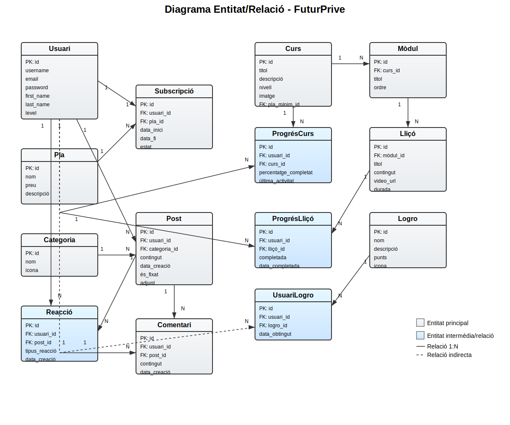
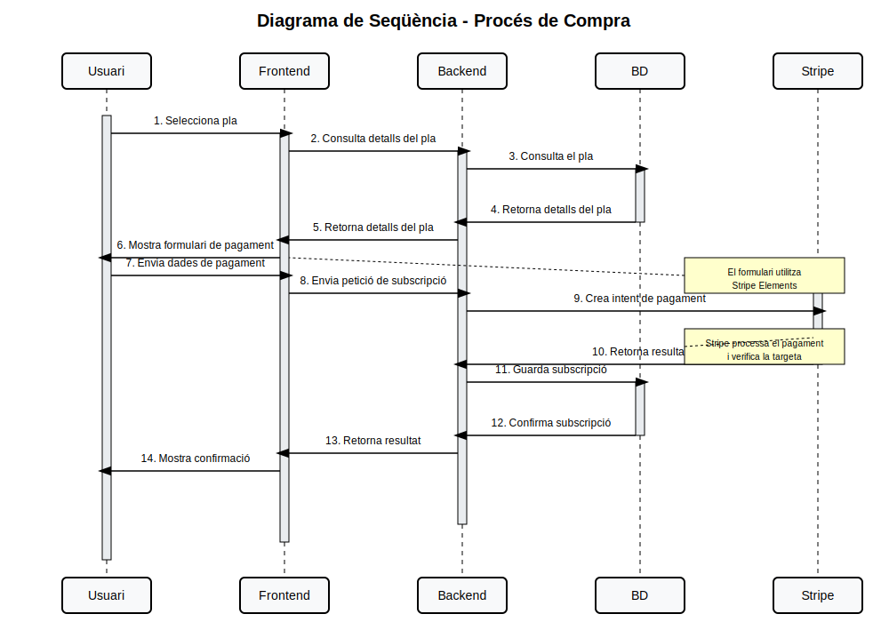

# FuturPrive - Documentació

## Objectius

FuturPrive és una plataforma de subscripció premium orientada a l'aprenentatge en línia. Els seus objectius principals són:

* Oferir cursos d'alta qualitat amb accés controlat mitjançant subscripcions.
* Proporcionar un espai de comunitat on els usuaris puguin interactuar i compartir coneixements.
* Implementar un sistema de gamificació per augmentar la motivació i el compromís dels usuaris.
* Facilitar el seguiment de l'aprenentatge mitjançant un sistema de progrés personalitzat.

## Arquitectura bàsica

El projecte segueix una arquitectura client-servidor amb els següents components:

* **Backend**: API REST desenvolupada amb Django i Django REST Framework.
* **Frontend**: Aplicació web de pàgina única (SPA) construïda amb Next.js.
* **Base de dades**: PostgreSQL per emmagatzemar totes les dades del sistema.
* **Sistema de pagaments**: Integració amb Stripe per gestionar subscripcions.
* **Desplegament**: Contenidors Docker orquestrats amb Docker Compose i Traefik per gestionar el trànsit.

## Tecnologies utilitzades

### Backend

* Django 4.x: Framework web de Python.
* Django REST Framework: Per construir l'API REST.
* Django Channels: Per a funcionalitats en temps real (notificacions, chat).
* PostgreSQL: Base de dades relacional.
* Celery: Per a tasques asíncrones.
* Redis: Com a broker de missatges i cache.

### Frontend

* Next.js: Framework React amb SSR i generació estàtica.
* TypeScript: Per a escriptura de codi amb tipatge.
* TailwindCSS: Utility-first CSS framework.
* SWR: Per a fetching i caching de dades.
* Context API / Redux: Per a gestió d'estat.

### Infraestructura

* Docker: Contenització d'aplicacions.
* Docker Compose: Orquestració de serveis.
* Traefik: Proxy invers i balancejador de càrrega.
* Let's Encrypt: Per a certificats SSL automàtics.

### Integració de pagaments

* Stripe: Processament de pagaments i gestió de subscripcions.

## Interrelació entre els diversos components
+------------------+         +------------------+
|                  |         |                  |
|    Frontend      |<------->|     Backend      |
|    (Next.js)     |   API   |    (Django)      |
|                  |   REST  |                  |
+------------------+         +--------+---------+
|
| ORM
v
+------------------+
|                  |
|   PostgreSQL     |
|   Database       |
|                  |
+------------------+
^
|
+------------------+
|                  |
|     Stripe       |
|   Integration    |
|                  |
+------------------+

El flux d'informació segueix aquests patrons:

* El frontend fa peticions a l'API REST del backend.
* El backend processa la petició, interactua amb la base de dades i retorna una resposta.
* Per a pagaments, el backend es comunica amb Stripe.
* Per a notificacions en temps real, s'utilitzen WebSockets via Django Channels.

## Com crees l'entorn de desenvolupament

### Requisits previs

* Git
* Docker i Docker Compose
* Node.js i npm (opcional, per desenvolupament frontend local)

### Passos

1.  Clona el repositori:

    ```bash
    git clone [https://github.com/your-username/futurprive.git](https://github.com/your-username/futurprive.git)
    cd futurprive
    ```

2.  Crea un fitxer `.env` a l'arrel del projecte:

    ```
    DATABASE_NAME=futurprive
    DATABASE_USER=usuario
    DATABASE_PASSWORD=contraseña
    ```

3.  Inicia els contenidors:

    ```bash
    docker compose up
    ```

4.  Accedeix a l'aplicació a: `http://localhost:3000`
5.  Accedeix a Adminer (gestió de BD) a: `http://localhost:8080`

    * Sistema: PostgreSQL
    * Servidor: postgres
    * Usuari: user
    * Contrasenya: password
    * Base de dades: futurprive

### Flux de desenvolupament

* El codi del backend s'actualitza automàticament gràcies a Django's autoreload.
* El codi del frontend s'actualitza amb hot-reloading de Next.js.
* Visualitza el flux de pantalles a Penpot.

## Com desplegues l'aplicació a producció

1.  Assegura't de tenir configurats els dominis `futurprive.com` i `api.futurprive.com` apuntant al teu servidor.
2.  Crea els fitxers d'entorn necessaris:
    * `.env` (arrel):

        ```
        DATABASE_NAME=database
        DATABASE_USER=usuari
        DATABASE_PASSWORD=password
        DATABASE_ENGINE=django.db.backends.postgresql
        DATABASE_PORT=5432
        DEBUG=False
        SECRET_KEY=tu_clave_secreta
        ALLOWED_HOSTS=localhost,127.0.0.1,0.0.0.0,futurprive.com,api.futurprive.com
        ```

    * `.env.prod` (arrel) - **NO pujar a Git!**:

        ```
        POSTGRES_DB=tu_db
        POSTGRES_USER=tu_user
        POSTGRES_PASSWORD=password
        ```

    * `backend/.env`:

        ```
        EMAIL_HOST=mail.privateemail.com
        EMAIL_PORT=587
        EMAIL_USE_TLS=True
        EMAIL_USE_SSL=False
        EMAIL_HOST_USER=correo
        EMAIL_HOST_PASSWORD=tu_contraseña_email
        DEFAULT_FROM_EMAIL=correo
        EMAIL_TIMEOUT=30
        SERVER_EMAIL=correo
        SITE_URL=[https://futurprive.com](https://futurprive.com)
        SECRET_KEY=tu_clave_secreta
        DEBUG=False
        ALLOWED_HOSTS=localhost,127.0.0.1,0.0.0.0,futurprive.com,api.futurprive.com,django
        DATABASE_ENGINE=django.db.backends.postgresql
        DATABASE_NAME=tu_dbname
        DATABASE_USER=tu_user
        DATABASE_PASSWORD=password
        DATABASE_PORT=5432
        ```

3.  Configura Traefik per a HTTPS:

    ```bash
    mkdir -p traefik
    touch traefik/acme.json
    chmod 600 traefik/acme.json
    ```

4.  Inicia els serveis en mode producció:

    ```bash
    docker-compose -f docker-compose.prod.yml up -d
    ```

5.  Executa les migracions:

    ```bash
    docker-compose -f docker-compose.prod.yml exec backend python manage.py migrate
    ```

6.  Crea un superusuari:

    ```bash
    docker-compose -f docker-compose.prod.yml exec backend python manage.py createsuperuser
    ```

L'aplicació estarà disponible a:

* Frontend: `https://futurprive.com`
* API: `https://api.futurprive.com`

## Llistat d'endpoints de l'API de backend

### Autenticació

* `POST /api/auth/token/`: Obté un token JWT d'accés i refresc.
* `POST /api/auth/token/refresh/`: Renova un token d'accés utilitzant el token de refresc.

### Usuaris

* `GET /api/users/me/`: Obté el perfil de l'usuari actual.
* `PUT /api/users/me/`: Actualitza

## Diagrama Entitat/Relació

Aquest diagrama mostra les entitats principals del sistema i les seves relacions. Inclou usuaris, plans, subscripcions, cursos, mòduls, lliçons, sistema de comunitat i gamificació.



### Entitats principals:

#### Usuaris i subscripcions
- **Usuari**: Emmagatzema la informació dels usuaris (dades personals, credencials, nivell)
- **Pla**: Els diferents plans de subscripció disponibles
- **Subscripció**: Relació entre usuaris i plans

#### Sistema de cursos
- **Curs**: Informació general dels cursos disponibles
- **Mòdul**: Agrupacions de contingut dins d'un curs
- **Lliçó**: Unitats d'aprenentatge específiques amb contingut

#### Seguiment d'aprenentatge
- **ProgrésCurs**: Registra el progrés d'un usuari en un curs
- **ProgrésLliçó**: Registra el progrés d'un usuari en lliçons específiques

#### Comunitat
- **Categoria**: Classificació dels posts de la comunitat
- **Post**: Publicacions dels usuaris
- **Comentari**: Comentaris en els posts
- **Reacció**: Reaccions dels usuaris als posts (likes)

#### Gamificació
- **Logro**: Assoliments que els usuaris poden aconseguir
- **UsuariLogro**: Registra els logros obtinguts pels usuaris

## Diagrama de Seqüència - Procés de Compra

Aquest diagrama mostra la seqüència d'interaccions entre els diferents components del sistema durant el procés de compra d'una subscripció.



### Passos del procés de compra:

1. **Usuari selecciona un pla de subscripció** - L'usuari navega pels plans disponibles i en selecciona un.
2. **Consulta de detalls del pla** - El frontend sol·licita els detalls complets del pla al backend.
3. **Consulta a la base de dades** - El backend obté la informació del pla de la base de dades.
4. **Mostra del formulari de pagament** - El frontend presenta un formulari de pagament a l'usuari utilitzant Stripe Elements.
5. **Enviament de dades de pagament** - L'usuari introdueix les seves dades de pagament i confirma la compra.
6. **Processament del pagament** - El backend comunica amb Stripe per processar el pagament.
7. **Creació de la subscripció** - Un cop el pagament s'ha processat correctament, es crea un registre de subscripció a la base de dades.
8. **Confirmació a l'usuari** - Es mostra a l'usuari una confirmació de la compra realitzada amb èxit.

Aquest flux garanteix una experiència de compra segura i fluida, delegant el processament de pagaments a Stripe mentre el sistema manté el control sobre les subscripcions i l'accés als continguts.